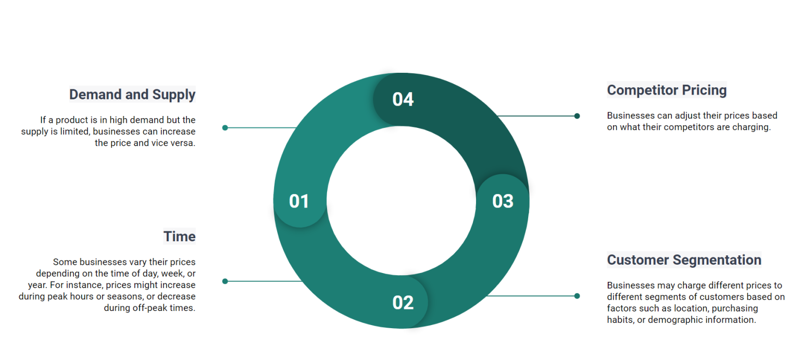

# Dynamic Pricing Project

A ride-sharing company wants to implement a dynamic pricing strategy to optimize fares based on real-time market conditions. The company currently only uses ride duration to decide ride fares. The company aims to leverage data-driven techniques to analyze historical data and develop a predictive model that can dynamically adjust prices in response to changing factors.

The main objective of this project is to build a dynamic pricing model to **predict optimal fares for riders** in real-time. The model must incorporate the features provided in the dataset and consider factors such as **demand patterns** and **supply availability**.

This project was made using data from https://www.kaggle.com/datasets/arashnic/dynamic-pricing-dataset under the CC0: Public Domain license.

## About the dataset
A dataset containing historical ride data has been provided by the company. It includes the following features:
- 'Number_of_Riders'
- 'Number_of_Drivers'
- 'Location_Category'
- 'Customer_Loyalty_Status'
- 'Number_of_Past_Rides'
- 'Average_Ratings'
- 'Time_of_Booking'
- 'Vehicle_Type'
- 'Expected_Ride_Duration'
- 'Historical_Cost_of_Ride'

## 

## References
- https://www.altexsoft.com/blog/dynamic-pricing-explained-use-in-revenue-management-and-pricing-optimization/
- https://towardsdatascience.com/dynamic-pricing-using-reinforcement-learning-and-neural-networks-cc3abe374bf5
- https://arxiv.org/abs/1912.02572
- https://www.uber.com/en-IN/blog/neural-networks/

